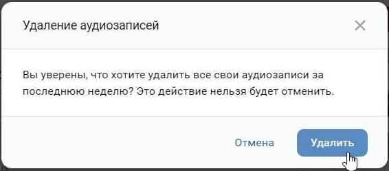

# vk-add-whole-playlist

Данный скрипт позволяет перенести все песни из VK плейлиста в список ваших аудиозаписей. Да, по какой-то причине VK не позволяет добавить песню в свои аудиозаписи, если она находится в плейлисте. Это позволяет сделать данная программа. 

### Содержание
1. [ПРЕДОСТЕРЕЖЕНИЯ](#предостережения)
1. [ПОСОБИЕ ПО ИСПОЛЬЗОВАНИЮ СКРИПТА](#пособие-по-использованию-скрипта)
1. [ПРЕИМУЩЕСТВА ПЕРЕД АЛЬТЕРНАТИВНЫМИ ПРОГРАММАМИ](#преимущества-перед-альтернативными-программами)
1. [РЕШЕНИЕ ПРОБЛЕМ](#решение-проблем)

## ПРЕДОСТЕРЕЖЕНИЯ

**ВАЖНО!** Данный скрипт не проверяет, добавлена ли уже песни в список ваших аудиозаписей. Из-за этого в списке аудио могут оказаться дубликаты. Это не влияет вообще ни на что, кроме того, что у вас будет добавлена одна и та же песня дважды. Если уже добавленных в аудиозаписи песен в плейлисте много, то использовать его будет нерационально, хотя и можно совершенно без проблем. 

## ПОСОБИЕ ПО ИСПОЛЬЗОВАНИЮ СКРИПТА
  
1. Найдите интересующий вас плейлист
1. Нажмите на его название, чтобы он открылся посередине страницы
1. Правой кнопкой нажмите в любое место страницы и откройте меню кода элемента
1. Откройте консоль и вставьте туда без изменений весь код данного файла. Просто Ctrl+C, Ctrl+V.
1. Нажмите Enter.
1. Не закрывайте страницу с плейлистом и консоль. Но вы можете продолжить пользоваться браузером в других вкладках.

## ПРЕИМУЩЕСТВА ПЕРЕД АЛЬТЕРНАТИВНЫМИ ПРОГРАММАМИ

1. Других альтернатив нет. Я не нашел ничего, что позволяло бы также добавить все песни из плейлиста в свои аудио.
1. Программа добавляет песни с помощью отправки POST запросов вместо эмуляции нажатия кнопки добавить. Это позволяет продолжать пользоваться браузером во время работы скрипта.
1. Простота использования. Просто скопируйте и вставьте код в консоль.
1. Скрипт позволяет продолжить добавление песен с того места, где вы остановились.

## РЕШЕНИЕ ПРОБЛЕМ
  
**Q:** Как быстро удалить все добавленные недавно песни?\
**A:** В ПК версии сайта при удалении нескольких песен, вконтакте добавит на крестике удаления предложение удалить все песни, добавленные за последнюю неделю.  

**Q:** Скрипт не работает. Что делать?\
**A:** Если что-то не работает, то, в зависимости от ситуации, решить проблему может добавление плейлиста в свои аудиозаписи и повторение всех шагов оттуда.

**Q:** Добавление было прервано капчей и не все песни добавились. Что делать?\
**A:** Скрипт позволяет продолжить добавление, начиная с определенной песни.
